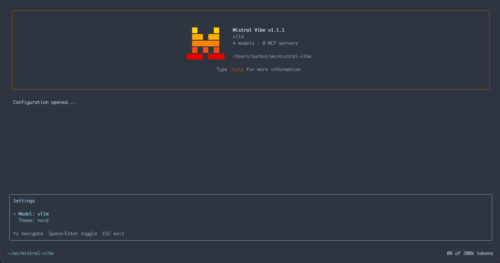

# Running Vibe with a Local Model (vLLM)

Vibe Mistral CLI, released this week, is Mistral's take on the agentic code CLI.  
However, one small detail is **not documented anywhere**: how to make Vibe work with **local models** instead of Mistral official APIs.
While there is an option local, it will only work for localhost. I however have a dedicated GPU server that I want to integrate. 

In this blog, I’ll walk you through how I successfully connected **Vibe CLI** to a **locally hosted model running on vLLM**, using *Devstral-2-123B-Instruct-2512* as the example.

This makes it possible to use Vibe fully offline.

---

## 🌐 Background

Mistral released **Devstral-2** and created the **Vibe CLI** tooling.  
Their announcement mentions support for custom providers but **does not include instructions** for configuring local inference endpoints.

Reference release post:  
https://mistral.ai/news/devstral-2-vibe-cli

Fortunately, Vibe internally speaks the **OpenAI API protocol**, which means it can connect to *any* server providing that interface — including `vllm`.

---

## 🛠️ Step 1 — Run your model with vLLM

On my setup, I’m running Devstral-2 on a GPU server that has **less VRAM than the “official” 4×H100 recommendation**.  
I was forced to lower the context size to make it possible to fit my GPUs. vLLM makes this possible with memory-tuning flags.

Here’s the exact command I use:

```bash
vllm serve Devstral-2-123B-Instruct-2512   --tool-call-parser mistral   --enable-auto-tool-choice   --tensor-parallel-size 4   --max-model-len 128000   --gpu-memory-utilization 0.9
```

A few notes on these flags:

- `--tool-call-parser mistral`  
  Keeps tool-calling compatible with how Devstral/Vibe expect function calls to be formatted.

- `--enable-auto-tool-choice`  
  Lets the model automatically decide when to call tools instead of hard-coding them.

- `--tensor-parallel-size 4`  
  Splits the model across 4 GPUs so you don’t need a single massive card.

- `--max-model-len 128000`  
  Bumps the context window while still staying within the practical limits of your VRAM.

- `--gpu-memory-utilization 0.9`  
  Pushes each GPU close to its memory limits so the model fits on smaller hardware.

Once running, vLLM exposes an OpenAI-compatible endpoint at:

```text
http://YOUR-IP:8000/v1
```

This is exactly what Vibe expects.

---

## 📝 Step 2 — Configure Vibe to use your local model

Install and run Vibe CLI, this will create a configuration file:

```text
~/.vibe/config.toml
```

And add:

```toml
[[providers]]
name = "vllm"
api_base = "http://some-ip:8000/v1"
api_key_env_var = ""
api_style = "openai"
backend = "generic"

[[models]]
name = "Devstral-2-123B-Instruct-2512"
provider = "vllm"
alias = "vllm"
temperature = 0.2
input_price = 0.0
output_price = 0.0
```

### Explanation

- **api_base** — Points Vibe to your local vLLM server  
- **api_key_env_var = ""** — vLLM does not require authentication  
- **api_style = "openai"** — tells Vibe to speak OpenAI-formatted requests  
- **backend = "generic"** — required for non-Mistral providers  
- **input/output pricing** — set to zero for local usage  
- **alias** — lets you call your model simply as `vllm` inside Vibe  

---

## ▶️ Step 3 — Run Vibe with your local model

Now you can select the model in Vibe:

```bash
/model
```

And you now should be able to see vllm as a provider.





---

## 🎉 Result

With this small configuration file, Vibe works perfectly with vLLM or could work with any other OpenAI compatible endpoint. 

---
